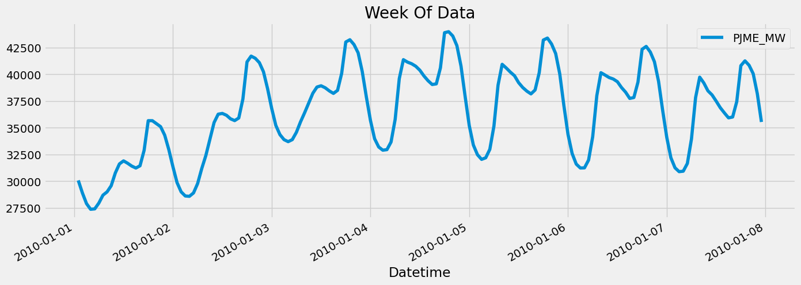

# Energy Consumption Forecast

 

I wanted to learn more about XGBoost and how it can be used to forecast energy consumption. I found a dataset on Kaggle that had hourly energy consumption data for a year. I used this dataset to train an XGBoost model to forecast energy consumption. I used the `xgboost` library in Python to train the model. I used `matplotlib` and `seaborn` to visualize the results.

The material provided is a selection of different notebooks that I used to learn about XGBoost and is not claimed to be original work. Check out the references section for links to the original material.

## Dataset

The dataset I used is from Kaggle. It can be found [here](https://www.kaggle.com/robikscube/hourly-energy-consumption). The dataset contains hourly energy consumption data for a year. The data is from PJM Interconnection LLC, a regional transmission organization (RTO) in the United States. The data is from 2002 to 2018. The dataset contains the following columns:

* `Datetime`: The date and time of the energy consumption data
* `PJME_MW`: The actual energy consumption in megawatts

## Notebook

The notebook can be found [here](EnergyConsumptionForecast.ipynb). The notebook contains the following sections:

- Loading the data
- Outlier removal
- Simple training method
    - Train/test split
    - Feature creation
    - Visualize our Feature / Target Relationship
    - Create and Train our Model
    - Feature Importance
    - Forecast on Test
    - Score (RMSE)
    - Calculate Error
- Time Series Cross Validation (+ using lag features)
    - Forecasting Horizon Explained
    - Lag Features
    - Training
    - Predicting the future
- Saving and loading the model

## Other methods
Despite having tried XGBoost, other methods could be tried (I will soon :)):
- LSTM model. Check out: [TensorFlow-Time-Series-Examples](https://github.com/hzy46/TensorFlow-Time-Series-Examples/blob/master/train_lstm.py)
- (S)ARIMA models. Check out an example using the `statsmodels` Python library [here](https://www.kaggle.com/code/mariavirginiaforcone/power-consumption-forecasting-with-sarima-tbats)
+ extra: interesting paper by Dubey et al.: [Study and analysis of SARIMA and LSTM in forecasting time series data](https://www.sciencedirect.com/science/article/pii/S2213138821004847?casa_token=FkimfUMjx2YAAAAA:T9aFS6-Eko13nFacz2rCtJiumXg5elUrUNZqUfh6MB-XQO3cXglIT1FbKZn5jgdUrKgNdtt2ESE) Abstract: Energy consumption forecasting is essential for smart grid operations as it facilitates electricity demand management and utilities load planning. In this paper data analytics has been presented on the collected smart meter measurement and then predicting the energy consumption on a daily basis using (autoregressive integrated moving average) ARIMA, seasonal ARIMA (SARIMA) and long short-term memory (LSTM). [...] The results indicate that the **energy consumption has a high positive correlation with humidity and high negative correlation with temperature**. (Dew point and UV index) and (Cloud cover and Visibility Display) have multicollinearity with temperature and humidity respectively, so, can be discarded. Pressure and Moon Phase have minimal correlation with energy consumption, so, it can also be discarded. Wind speed has low correlation with energy, but it does not show multicollinearity. So, it can be considered for further analysis. **Overall LSTM found to be prominent in comparison to ARIMA and SARIMA** with the average mean absolute error (MAE) of 0.23.

## References

* [XGBoost Documentation](https://xgboost.readthedocs.io/en/latest/)
* [XGBoost Paper](https://arxiv.org/abs/1603.02754)

Most of the material I used in this notebook came from the following notebook by [Rob Mulla](https://www.kaggle.com/code/robikscube/time-series-forecasting-with-machine-learning-yt). Check out his YouTube channel [here](https://www.youtube.com/@robmulla).
